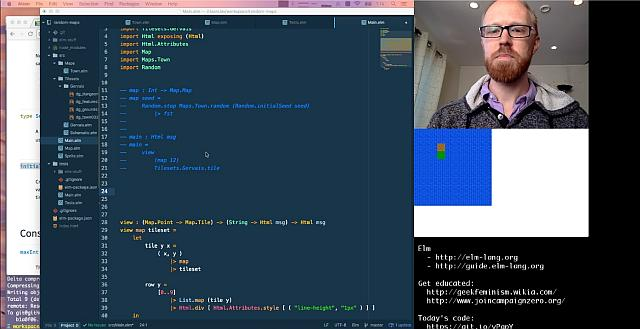
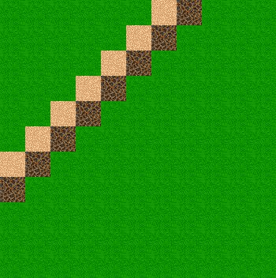
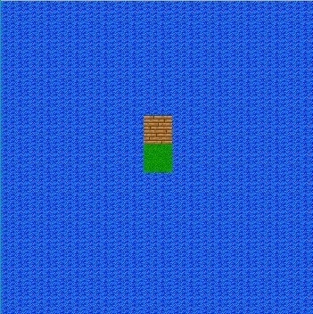

# elmlive random maps (fuzz testing)

## Following along @avh4 #elmlive [youtube 5 parts starting here](https://www.youtube.com/watch?v=rgdZZuM513w)

"Today we learn about fuzz tests (property tests) and try to make a random map generator using test-driven development."

 

Code is at <https://github.com/ElmLive/random-maps/tree/ElmLive-2016-10-02>

the tiles come from <http://pousse.rapiere.free.fr/tome/tome-tiles.htm>

the elm module we are using is <http://package.elm-lang.org/packages/elm-community/elm-test/latest/>

### commands

- `md elmlive-randommaps`
- `cd elmlive-randommaps`
- `git init`
- `elm make`
- `echo "/elm-stuff/" >> .gitignore`
- `git remote add origin https://github.com/Rolograaf/elmlive-randommaps.git`
- `npm init` or `yarn install`
- `npm install --save-dev elm elm-live` for installing the live server
- `npm run elm-live` to start the server ( or `./node_modules/.bin/elm-live src/Main.elm --open` )
- `npm install --save-dev elm-test`
- `npm run test-init` to run `./node_modules/.bin/elm-test init`
- `npm run test` or `yarn test` to run elm-test

## To be continued

<https://youtu.be/He-NvUf8G7Q?t=1236>
