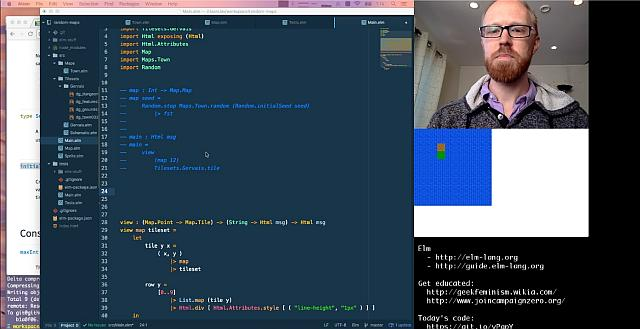
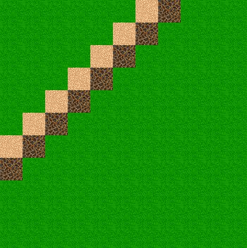
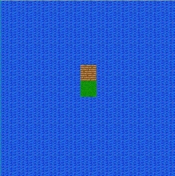
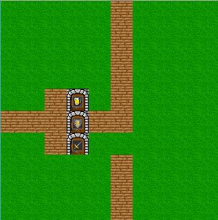
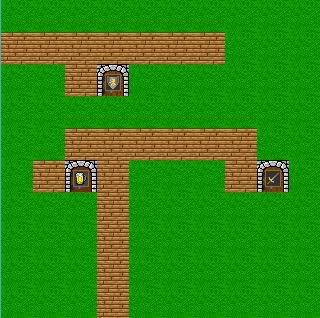

# elmlive random maps (fuzz testing)

## Following along @avh4 #elmlive [youtube 5 parts starting here](https://www.youtube.com/watch?v=rgdZZuM513w)

"Today we learn about fuzz tests (property tests) and try to make a random map generator using test-driven development."

## some Town Maps during the elmlive session

 

Code is at <https://github.com/ElmLive/random-maps/tree/ElmLive-2016-10-02>

the tiles come from <http://pousse.rapiere.free.fr/tome/tome-tiles.htm>

the elm module we are using is <http://package.elm-lang.org/packages/elm-community/elm-test/latest/>

## Tips and picks

- [Elm search for looking up API functions and types](http://klaftertief.github.io/package.elm-lang.org/) ( written in elm and uses localstorage, check source out! )
- [fira code font](https://github.com/tonsky/FiraCode) with ligatures, can be used in atom
- [elmlive Greg Ziegan RPG Platform](https://www.youtube.com/watch?v=rLSrQjYFVoU&list=PL8wLtAjUdVWCX45d2dWbM3KDADYJgImet)
- [Procedural Generation Jam 2016](https://itch.io/jam/procjam) on October 21st at Falmouth University in Cornwall

### commands

- `md elmlive-randommaps`
- `cd elmlive-randommaps`
- `git init`
- `elm make`
- `echo "/elm-stuff/" >> .gitignore`
- `git remote add origin https://github.com/Rolograaf/elmlive-randommaps.git`
- install [yarn](https://yarnpkg.com/en/docs/install) as alternative to npm
- `set PATH=%PATH%;C:\Program Files (x86)\Yarn\bin`
- `npm init` or `yarn install`
- `npm install --save-dev elm elm-live` for installing the live server
- `npm run elm-live` to start the server ( or `./node_modules/.bin/elm-live src/Main.elm --open` )
- `npm install --save-dev elm-test`
- `npm run test-init` to run `./node_modules/.bin/elm-test init`
- `npm run test` or `yarn test` to run elm-test

### Rule ideas

- [ ] add a density factor that weights the probability of road tiles vs grass
- [ ] roads should always connect to other roads
- [x] there should be at least 10% (10 tiles) grass
- [x] has exactly one Inn, at least one Weapon shop and at least one Armor shop door.
- [x] there should be at least a road tile adjacent to the doors
- [ ] the doors should be connected to a road tile should be connected to another upto the edge of the town map
- [ ]

## To be continued

<https://youtu.be/FUnAImr6gpc?t=970>
